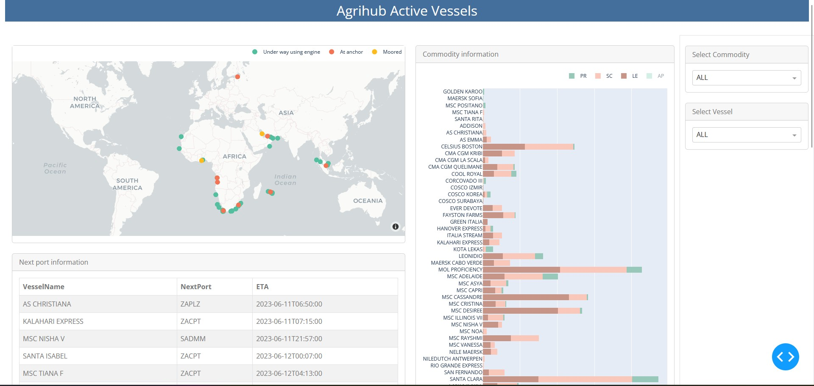

# Vessel Location Dashboard

The **Agrihub Active Vessels Dashboard** tracks vessels with South African fruit for 40 days after sailing from a South African load port. The next port on each vessel's voyage is provided with an estimated time of arrival.



## Data sources
Two data sources are used for this dashboard:
1. The Agrihub summary statistics. Volume data of all Agrihub-tracked produce leaving South African ports (pome, stone, citrus, table grapes) in containers.
2. [MarineTraffic Single Vessel Position API (PS07)](https://www.marinetraffic.com/en/ais-api-services/detail/ps07/single-vessel-positions): Each vessel is called once a day to determine location. Only vessels that have sailed from at least one South African load port are tracked.

## Technology
The dashboard was created using *[Plotly Dash](https://dash.plotly.com/)* and is hosted on an Azure Web App.

## Getting started
Ensure an active connection to the Agrihub Database. Add a '.env' file to the root folder with the following variables:

```
MYSQLLINUXP=mysql+pymysql://<USERNAME>:<PASSWORD>@<HOST>:<PORT>/<DATABASE>
SSHUN=<SSH USERNAME>
SSHUP=<SSH PASSWORD>
SSHH=<SSH HOST>
```


